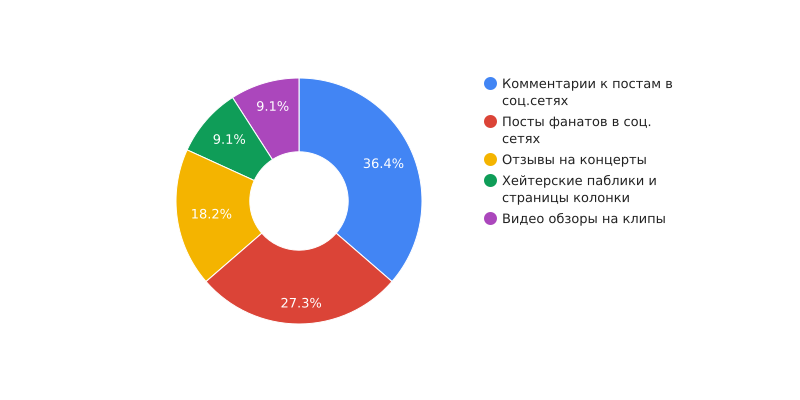

# Стереотипы о фанатах различных музыкальных жанров и их влияние на культуру

### Вводная часть:
Цифровая грамотность становится все более важной в современном мире, особенно среди молодежи, ибо цифровые технологии играют значительную роль в их повседневной жизни. В контексте музыкальной культуры, существует множество стереотипов о фанатах различных музыкальных жанров, которые могут оказывать влияние на культуру в целом.

### Цели:
- Изучить стереотипы о фанатах различных музыкальных жанров в цифровом пространстве.
- Проанализировать влияние этих стереотипов на музыкальную культуру и общество в целом.

### Гипотезы:
- Фанаты различных музыкальных жанров могут быть подвержены стереотипам из-за своих музыкальных предпочтений.
- Стереотипы о фанатах могут влиять на то, как общество воспринимает определенные музыкальные жанры.

### Задачи:
1. Провести анализ цифровых платформ (социальные сети, видеохостинги, музыкальные стриминговые сервисы) для выявления стереотипов о фанатах различных музыкальных жанров.
2. Изучить влияние этих стереотипов на музыкальную культуру и поведение людей.
3. Предложить возможные способы преодоления негативных стереотипов и укрепления позитивных представлений о фанатах музыки.

## Основная часть:
Для основной части проекта мы можем рассмотреть примеры стереотипов о фанатах различных музыкальных жанров, таких как рок, хип-хоп, поп, техно и т.д. Мы сможем анализировать как эти стереотипы формируются и распространяются в цифровых медиа, и как они сказываются на культуре и образе жизни.

### Рассмотрим примеры стереотипов о фанатах различных музыкальных жанров:

****1. Рок:**** Фанаты рока часто ассоциируются с длинными волосами, черной одеждой, кожаными куртками и рок-фестивалями. В цифровых медиа эти стереотипы могут усиливаться изображениями рок-звезд, рок-концертов и обсуждениями о "рок-образе жизни".

****2. Хип-хоп:**** Фанаты хип-хопа часто ассоциируются с уличной модой, золотыми украшениями, раперскими жаргонными выражениями и танцами. В цифровых медиа стереотипы о хип-хопе могут усиливаться через музыкальные видео, социальные сети и обсуждения рэп-исполнителей.

****3. Поп:**** Фанаты поп-музыки зачастую ассоциируются с яркой модой, молодежными трендами, поп-концертами и публичными выступлениями звезд. В цифровых медиа стереотипы о поп-музыке могут быть поддержаны через музыкальные видео, живые трансляции концертов и Instagram-публикации известных поп-артистов.

****4. Техно:**** Фанаты техно культуры могут быть ассоциированы с электронной музыкой, ночной жизнью, танцевальными фестивалями и "космическими" атмосферами. В цифровых медиа стереотипы о техно могут передаваться через музыкальные стримы, фотоотчеты с техно-вечеринок и обсуждения новых треков на специализированных форумах.

Анализируя эти стереотипы в цифровых медиа, мы можем понять, как они формируют представления о культуре и образе жизни фанатов различных музыкальных жанров.

****Методы и инструменты анализа:****

__1. Определить целевые платформы:__ выбрать социальные сети, где обитают фанаты музыкальных жанров, которые вас интересуют. Например, это может быть Facebook, Twitter, Instagram, Reddit, или специализированные музыкальные платформы как SoundCloud или Bandcamp.

__2. Проанализировать хэштеги и ключевые слова:__ провести поиск популярных хэштегов и ключевых слов, связанных с конкретными музыкальными жанрами, и использовать их для поиска дискуссий, групп и сообществ.

__3. Изучить активность и участников:__ изучить активность и обсуждения в выбранных группах и сообществах, оценить количество участников, темы обсуждений, их отношение к разным аспектам музыкального жанра.

__4. Использовать инструменты аналитики:__ воспользоваться инструментами аналитики социальных сетей (например, встроенными функциями поиска, анализа хэштегов, или специализированными аналитическими приложениями), чтобы выявить тенденции, предпочтения и поведение целевой аудитории.

## Изучение дискуссий, групп и сообществ, посвященных различным музыкальным жанрам

__Вконтакте,Twitter и Instagram*__  (принадлежит корпорации Meta, которая признана экстремистской на территории РФ) - это отличные платформы для изучения предпочтений и поведения фанатов различных музыкальных жанров. Вконтакте является наиболее популярной социальной сетью в России и странах СНГ, и она обладает множеством сообществ и групп, посвященных различным музыкальным жанрам. Instagram также предоставляет уникальную возможность изучать предпочтения аудитории через визуальное поведение пользователей, так как многие фанаты музыки делятся своими интересами и музыкальным контентом в этой социальной сети. Twitter также известен своей важной ролью в обсуждении музыкальных новостей и событий, а также участниками активных дискуссий о музыкальных жанрах и исполнителях. Выбор и изучение этих социальных платформ позволит получить разнообразную информацию о поведении фанатов музыкальных жанров, их предпочтениях, реакциях на новости и события в мире музыки.

Для анализа популярных хэштегов и ключевых слов в социальной сети ВКонтакте, связанных с конкретными музыкальными жанрами, используется встроенный поиск и инструменты для мониторинга популярности хэштегов. Например, нас интересует рок-музыка, производим поиск популярных хэштегов, таких как #rock, #rockmusic, #hardrock, #alternative, #metal и т.д. 

1. Комментарии к постам в соц. сетях:
Оценка вероятности формирования стереотипов через дискуссии и реакции к сообщениям.

2. Посты фанатов в соц. сетях:
Анализ контента, выявление тем, которые часто подвергаются стереотипизации в сообществах фанатов.

3. Отзывы на концерты:
Исследование возможности появления стереотипов, связанных с концертным опытом и восприятием зрителей.

4. Хейтерские паблики и страницы колонки:
Определение вероятности наличия негативных стереотипов, направленных на фанатов музыкальных жанров.

5. Видеообзоры на клипы:
Анализ возможности формирования стереотипов о фанатах через визуальное восприятие клипов и их обзоры.

Данная диаграмма поможет выделить ключевые точки, где стереотипы о фанатах музыкальных жанров могут быть наиболее распространены в цифровом пространстве, обеспечивая более целенаправленный анализ воздействия на культуру.

### Фанаты рока

1. Стиль одежды и внешний облик. Фанаты рока часто ассоциируются с определенным стилем одежды, таким как кожаные куртки, футболки с изображением рок-групп, джинсы, выразительный грим и аксессуары (кожаные браслеты, бижутерия в стиле рока).
2.Музыкальные предпочтения. Очевидно, что фанаты рока предпочитают рок-музыку различных направлений: классический рок, хард-рок, панк-рок, металл и другие. Это может включать в себя популярные группы и исполнителей, а также менее известные группы в жанре.
3. Отношение к обществу. Фанаты рока иногда могут восприниматься как нонконформисты или люди с альтернативным взглядом на мир. Они могут быть приверженцами индивидуальности, свободы самовыражения и нестандартных идей.

- Фанаты рок-музыки могут столкнуться с непониманием и предубеждением со стороны людей, придерживающихся стереотипов о них, что может вызвать конфликты и неприязнь.
- Негативные представления о фанатах рок-музыки могут ограничить их возможности в образовании, трудоустройстве и социальной сфере из-за недопонимания и предвзятости.
- Фанаты рок-музыки могут начать воспринимать себя сквозь призму стереотипов, что может повлиять на их самооценку и уверенность в себе.
- Стереотипы могут способствовать распространению недопонимания и конфликтов между людьми с разными музыкальными предпочтениями.

### Фанаты хип-хоп музыки

1. Фанаты хип-хопа часто представляются как люди, имеющие жесткий и агрессивный образ жизни, связанный с уличной культурой.
2. Им приписывается склонность к насилию, употреблению наркотиков и негативному поведению.
3. Они могут восприниматься как невежественные и необразованные, предпочитающие простую и агрессивную музыку.
4. Фанаты хип-хопа нередко ассоциируются с различными проблемами и социальными недугами, такими как безработица, криминал и нарушения закона.
5. Их также могут представлять в качестве людей, склонных к показу своего богатства и материального успеха, через высококлассные машины, дорогие одежды и щедрое размахивание деньгами.

- Фанаты хип-хопа могут столкнуться с предубеждением и социальной изоляцией из-за стереотипов, связанных с их музыкальными предпочтениями.
- Навязанные представления о фанатах хип-хопа как о людях, связанных с насилием и нарушениями закона, могут привести к отрицательному восприятию и предрассудкам со стороны общества.
- Стереотипы могут создавать преграды для фанатов хип-хопа в образовании, трудоустройстве и других сферах жизни.
- Люди, которые подвергаются стереотипам, могут начать воспринимать себя в соответствии с этими представлениями, что может привести к негативному влиянию на их самооценку и уверенность.

### Фанаты поп-музыки

1. Фанаты поп-музыки часто ассоциируются с поверхностностью и недостатком музыкального вкуса, предпочитая коммерческую и простую музыку.
2. Их считают поверхностными и непоследовательными в своих музыкальных предпочтениях, поддерживающими только популярных исполнителей и недостаточно ценящими талант и оригинальность.
3. Их часто представляют в качестве подражателей знаменитостей, замешанных на интригах и сплетнях в мире шоу-бизнеса.
4. Фанаты поп-музыки иногда ассоциируются со стереотипом внешней привлекательности и поверхностных интересов.
5. Им приписывается отрицательное отношение к более серьезной и глубокой музыке, а также к нежеланию исследовать другие жанры и стили.

- Стереотип о фанатах поп-музыки как о поверхностных и "неправильно" музыкально осведомленных людей может привести к их непониманию и осуждению со стороны других людей.
- На основе этих стереотипов фанаты поп-музыки также могут столкнуться с ограничениями в образовании и трудоустройстве.
- Воздействие стереотипов может отрицательно сказаться на самооценке фанатов поп-музыки и убедить их в том, что их интересы не стоят защиты.
- Фанаты поп-музыки могут столкнуться с дискриминацией, насмешками и негативными комментариями, что может привести к стрессу и психологическим проблемам.
   
### Фанаты техно-музыки

1. Фанаты электронной музыки часто ассоциируются с пристрастием к наркотикам и непрерывным весельем на вечеринках.
2. Им приписывается невежливость и агрессивное поведение на концертах и фестивалях.
3. Они считаются непостоянными и поверхностными в своем интересе к музыке, склонными к хипстерству.
4. Фанаты электронной музыки предполагаются как люди, стремящиеся к экстравагантным нарядам и выражению своей индивидуальности через внешний вид.
5. Им приписывается нежелание или неспособность понимать или ценить другие жанры музыки.

- Фанаты электронной музыки могут столкнуться с предубеждением и непониманием со стороны людей, которые придерживаются стереотипов о них, что может вызвать конфликты и напряженность в общении.
- Негативные представления о фанатах электронной музыки могут ограничить их возможности в образовании, трудоустройстве и социальной сфере из-за недопонимания и предвзятости.
- Фанаты электронной музыки могут начать воспринимать себя сквозь призму стереотипов, что может повлиять на их самооценку и уверенность в себе.
- Стереотипы могут способствовать распространению непонимания и конфликтов между людьми, имеющими различные музыкальные предпочтения.
   
## Способы преодоления негативных стереотипов о фанатах различных музыкальных жанров и укрепления позитивных представлений о фанатах музыки могут включать в себя:

1. Образовательные кампании: Создание информационных кампаний и мероприятий, которые помогут демонтировать стереотипы и показать разнообразие фондов и ценностей у фанатов различных музыкальных жанров. 

2. Поддержка музыкального образования: Поддержка программ и проектов, которые способствуют музыкальному образованию, помогут демонстрировать разнообразие и богатство музыкальной культуры. 

3. Сообщество и диалог: Создание площадок для общения и диалога между представителями различных музыкальных сообществ для уважительного обмена мнениями и опытом. 

4. Поддержка разнообразия в музыкальных событиях: Содействие разнообразию музыкальных событий, фестивалей и концертов, чтобы продемонстрировать широкий спектр музыкальных предпочтений и культурных выражений. 

5. Поддержка позитивных образцов: Подчеркивание примеров позитивного влияния, которое могут оказывать фанаты музыки, и проведение кампаний, направленных на чувство гордости за музыкальные предпочтения. 

6. Интернет-активизм: Создание содержания в социальных сетях, блогах и других онлайн-платформах для поддержки и показа разнообразия музыкальных стилей и их фанатов.
